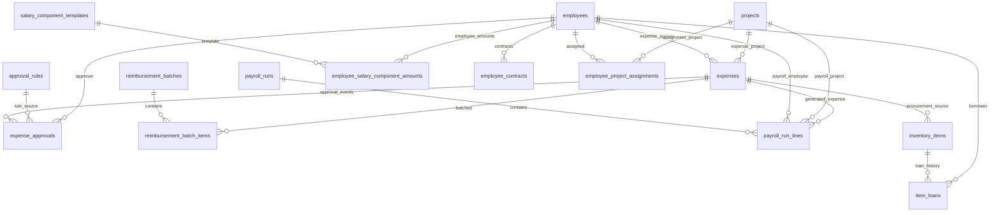

# Entity Relationship Document (ERD)

## 1. Tujuan Dokumen

Dokumen ini mendeskripsikan model data inti aplikasi Exrok, relasi antartabel, kardinalitas, status/enums penting, serta asumsi yang diperlukan ketika terdapat perbedaan antara migration SQL dan generated type definitions.

## 2. Ruang Lingkup Entitas Inti

- `employees`
- `projects`
- `expenses`
- `approval_rules`
- `expense_approvals`
- `reimbursement_batches`
- `reimbursement_batch_items`
- `payroll_runs`
- `payroll_run_lines`
- `salary_component_templates`
- `employee_salary_component_amounts`
- `employee_contracts`
- `employee_project_assignments`
- `inventory_items`
- `item_loans`
- `audit_logs`

## 3. Diagram ER (Mermaid)

## 4. Definisi Entitas dan Kolom Kunci

### 4.1 `employees`

- **PK**: `id`
- **Kolom penting**: `full_name`, `email`, `role`, `status`, `salary_amount`, `nip`, `job_title`, `is_permanent`, `tax_status`, `ptkp_status`
- **Fungsi bisnis**: master identitas pegawai dan sumber role runtime.

### 4.2 `projects`

- **PK**: `id`
- **Kolom penting**: `name`, `client_name`, `status`
- **Fungsi bisnis**: klasifikasi transaksi/penugasan.

### 4.3 `expenses`

- **PK**: `id`
- **FK utama**: `project_id -> projects.id`, `employee_id -> employees.id`, `reimbursement_batch_id -> reimbursement_batches.id` (asosiasi aktif)
- **Kolom penting**: `ref_no`, `submission_date`, `transaction_date`, `type`, `status`, `amount`, `vat`, `admin_fee`, `service_fee`, `total_payment`, `payment_date`, `payment_proof_url`, `document_url`, `created_by`
- **Fungsi bisnis**: pusat transaksi finance (PO, Reimburse, Salary).

### 4.4 `approval_rules`

- **PK**: `id`
- **FK**: `approver_employee_id -> employees.id`
- **Kolom penting**: `business_unit`, `expense_type`, `payment_methods`, `excluded_payment_methods`, `min_amount`, `max_amount`, `require_approval`, `priority`, `is_active`, `created_by`
- **Fungsi bisnis**: rule matching saat submit expense.

### 4.5 `expense_approvals`

- **PK**: `id`
- **FK**: `expense_id -> expenses.id`, `approval_rule_id -> approval_rules.id`, `approver_employee_id -> employees.id`
- **Kolom penting**: `status`, `notes`, `approved_at`
- **Fungsi bisnis**: menyimpan event keputusan approval.

### 4.6 `reimbursement_batches`

- **PK**: `id`
- **Kolom penting**: `batch_no`, `batch_date`, `payment_method`, `reference_no`, `notes`, `total_amount`, `created_by`
- **Fungsi bisnis**: header batch pembayaran reimbursement.

### 4.7 `reimbursement_batch_items`

- **PK**: `id`
- **FK**: `batch_id -> reimbursement_batches.id`, `expense_id -> expenses.id`
- **Kolom penting**: `amount_paid`
- **Fungsi bisnis**: item detail per expense dalam batch.

### 4.8 `payroll_runs`

- **PK**: `id`
- **Kolom penting**: `period_year`, `period_month`, `status`, `created_by`
- **Fungsi bisnis**: header proses payroll periodik.

### 4.9 `payroll_run_lines`

- **PK**: `id`
- **FK**: `run_id -> payroll_runs.id`, `employee_id -> employees.id`, `project_id -> projects.id` (nullable), `expense_id -> expenses.id` (nullable)
- **Kolom penting**: `amount`, `base_amount`, `adjustments`, `ter_category`
- **Fungsi bisnis**: detail line payroll dan jembatan ke expense salary.

### 4.10 `salary_component_templates`

- **PK**: `id`
- **Kolom penting**: `code`, `label`, `kind`, `is_active`, `include_in_monthly_payroll`
- **Fungsi bisnis**: master komponen kompensasi.

### 4.11 `employee_salary_component_amounts`

- **PK**: `id`
- **FK**: `employee_id -> employees.id`, `template_id -> salary_component_templates.id`
- **Unique**: `(employee_id, template_id)`
- **Kolom penting**: `amount`
- **Fungsi bisnis**: nominal komponen per pegawai.

### 4.12 `employee_contracts`

- **PK**: `id`
- **FK**: `employee_id -> employees.id`, `replaces_contract_id -> employee_contracts.id` (self-reference)
- **Kolom penting**: `start_date`, `end_date`, `notes`
- **Fungsi bisnis**: histori kontrak kerja.

### 4.13 `employee_project_assignments`

- **PK**: `id`
- **FK**: `employee_id -> employees.id`, `project_id -> projects.id`
- **Kolom penting**: `is_primary`, `started_on`, `ended_on`
- **Fungsi bisnis**: assignment pegawai ke proyek secara temporal.

### 4.14 `inventory_items`

- **PK**: `id`
- **FK**: `expense_id -> expenses.id` (nullable)
- **Kolom penting**: `name`, `type`, `stock`, `condition`, `serial_no`, `purchase_date`
- **Fungsi bisnis**: master inventaris dan jejak pengadaan.

### 4.15 `item_loans`

- **PK**: `id`
- **FK**: `item_id -> inventory_items.id`, `employee_id -> employees.id`
- **Kolom penting**: `loan_date`, `return_date`, `status`, `notes`
- **Fungsi bisnis**: transaksi peminjaman inventaris.

### 4.16 `audit_logs`

- **PK**: `id`
- **Kolom penting**: `table_name`, `record_id`, `action`, `old_data`, `new_data`, `actor_id`, `created_at`
- **Catatan**: `record_id` bersifat polimorfik (logical relation), bukan FK langsung.

## 5. Relasi dan Kardinalitas

- `employees (1) -> (N) expenses`: satu pegawai dapat terkait ke banyak expense.
- `projects (1) -> (N) expenses`: satu project dapat menaungi banyak expense.
- `expenses (1) -> (N) expense_approvals`: satu expense dapat memiliki beberapa event approval.
- `approval_rules (1) -> (N) expense_approvals`: satu rule dapat memicu banyak approval record.
- `reimbursement_batches (1) -> (N) reimbursement_batch_items`: satu batch punya banyak item.
- `expenses (1) -> (N) reimbursement_batch_items`: satu expense bisa muncul dalam item batch (historis).
- `payroll_runs (1) -> (N) payroll_run_lines`: satu run memiliki banyak line.
- `employees (1) -> (N) payroll_run_lines`: payroll line selalu menunjuk employee.
- `salary_component_templates (1) -> (N) employee_salary_component_amounts` dan `employees (1) -> (N) employee_salary_component_amounts`: membentuk relasi M:N logical via tabel amount.
- `employees (1) -> (N) employee_project_assignments` serta `projects (1) -> (N) employee_project_assignments`: assignment M:N terhadap waktu.
- `inventory_items (1) -> (N) item_loans`: item dapat dipinjam berulang.

## 6. Enumerasi, Status, dan Constraint Utama

- `employees.role`: `owner | finance | ga | staff`
- `employees.status`: `Active | Inactive` (implementasi tipe)
- `expenses.type`: `PO | Reimburse | Salary`
- `expenses.status`: `Draft | Pending Approval | Approved | Rejected | Paid`
- `expense_approvals.status`: `Pending | Approved | Rejected`
- `approval_rules.business_unit`: `RKT | SPH` (nullable)
- `salary_component_templates.kind`: `earning | deduction`
- `payroll_runs.status`: `draft | submitted`
- `inventory_items.type`: `Asset | Consumable`
- `item_loans.status`: `Active | Returned | Overdue`
- `audit_logs.action`: `INSERT | UPDATE | DELETE`

## 7. Keamanan Data dan RLS (Ringkas)

- RLS aktif pada tabel domain utama.
- Fungsi helper autentikasi/otorisasi (`get_my_role`, `get_my_employee_id`, `get_my_employee_record`) digunakan untuk evaluasi policy.
- Beberapa fungsi helper dijalankan sebagai `SECURITY DEFINER` dengan pengaturan `row_security = off` untuk menghindari rekursi policy.
- Mekanisme emergency SQL tersedia untuk menonaktifkan/menyalakan kembali RLS pada tabel kritikal saat insiden.

## 8. Asumsi dan Gap Skema

Beberapa elemen muncul di `src/types/database.types.ts` namun tidak terverifikasi jelas pada migration yang tersedia:

- Kolom expenses: `category_id`, `subcategory_id`, `vendor_id`, `business_unit`, `department`, `payment_method`, `due_date`, `payment_date`.
- Master table domain terkait: kategori/subkategori expense dan vendors.

Asumsi dokumentasi:

- Kolom/tabel tersebut sudah ada di environment aktif melalui migration yang tidak tercakup snapshot saat ini atau perubahan manual terkontrol.
- Relasi ke `auth.users` untuk kolom `created_by` bersifat logical relation (tanpa FK eksplisit).

## 9. Catatan Integritas Data

- `expenses.total_payment` diperlakukan sebagai nilai turunan dari komponen biaya.
- Status transitions dikendalikan oleh RPC dan action guard, bukan update bebas.
- `payroll_run_lines.expense_id` menjadi jejak pembentukan expense salary saat submit payroll.
- `reimbursement_batch_items` diprioritaskan sebagai sumber itemized payout history.

